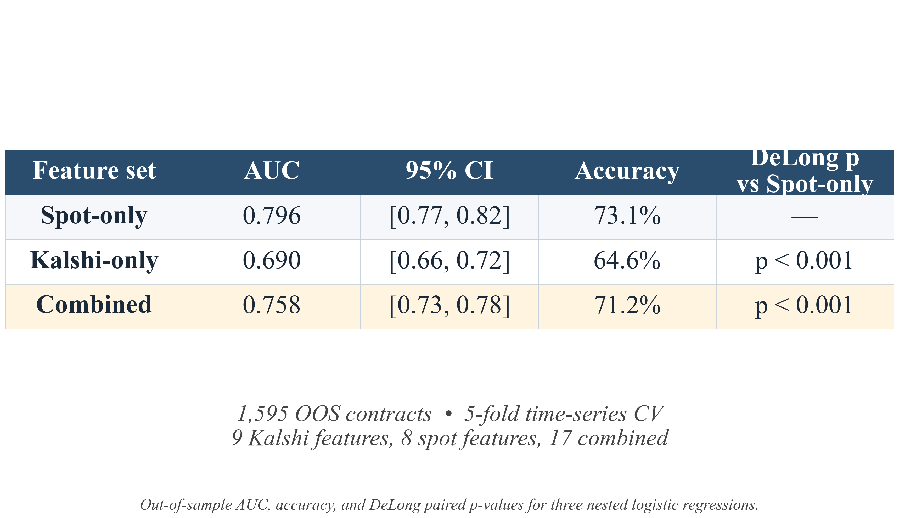

# Research Question

Kalshi 15-minute BTC and ETH contracts deliver minute-level, financially-incentivized estimates of crowd belief about short-horizon directional outcomes in the underlying cryptocurrency. In the quantitative finance literature, prediction-market probabilities are most commonly treated as alternative sentiment factors — measurements of forward-looking belief that complement, or front-run, the price tape. The question motivating this analysis is whether Kalshi probabilities support that interpretation in spot crypto markets, or whether they are better characterized as a noisy and delayed reflection of the spot tape itself.

# Data and Identification

The Kalshi panel covers 2,264 BTC and 1,943 ETH 15-minute contracts at 1-minute resolution over the period 15 February 2026 through 28 March 2026, recording the up-resolution probability P(UP), traded volume, and the realized contract outcome at each minute inside each contract.

The benchmark price series are Coinbase BTC-USD and ETH-USD 1-minute spot candles pulled from the Coinbase Exchange public REST endpoint (api.exchange.coinbase.com/products/{product}/candles) at 60-second granularity over the same window in 300-bar chunks. Coinbase was chosen in preference to Binance.US after a pilot pull found that approximately 45 percent of Binance.US 1-minute bars in this period were zero-volume, an attenuation problem severe enough to bias any short-horizon correlation estimate toward zero. Each Coinbase bar records UTC open time, open, high, low, close, and traded volume. Bars are joined to the Kalshi panel by exact UTC minute timestamp; after the join the BTC sample contains 31,658 and the ETH sample 27,176 minute-level observations across the contract panel.

Three independent diagnostics are applied to characterize the information structure between the two venues. The first is a cross-correlogram of within-contract minute changes ΔP(UP) against spot 1-minute log returns at lags k ∈ [−10, +10], using cluster bootstrap over contracts to preserve within-contract dependence. The second is the Lo–MacKinlay (1988) variance ratio applied separately to pooled within-contract changes in P(UP) and to continuous 1-minute log spot returns, with cluster bootstrap for the contract panel and stationary block bootstrap for the continuous spot series. The third is a logistic-regression classification of contract outcomes under three nested feature sets — spot-only, PM-only, and the combination of the two — with 5-fold time-series cross-validation and bootstrap confidence intervals on out-of-sample AUC. All three diagnostics use only information available within the first five minutes of each contract.

# Finding 1: Spot Leads P(UP) by Approximately Two Minutes

For each minute-level observation at UTC time t inside Kalshi contract c, the lag-k correlation between the within-contract change in P(UP) and the spot 1-minute log return at time t + k is computed,

ρ_k = corr(ΔP(UP)_{c,t}, r_{t+k}),    k ∈ [−10, +10],

where positive k indicates that P(UP) leads spot and negative k indicates that spot leads P(UP).

*Figure 1. Cross-correlogram of ΔP(UP) against spot 1-minute log returns at lags from −10 to +10 minutes, separately for BTC and ETH. Asterisks mark lags where the 95% cluster-bootstrap confidence interval excludes zero.*

The peak is unambiguous and identical across assets, occurring at lag k = −2 with r = +0.510 (95% CI [0.490, 0.526]) for BTC and r = +0.474 (95% CI [0.441, 0.500]) for ETH on samples of 31,658 and 27,176 observations respectively. A secondary peak at k = −1 reaches r ≈ +0.32–0.34. The contemporaneous correlation at lag zero is statistically zero, and every PM-leading lag (k ≥ 0) is zero or negative. Spot moves are reflected in P(UP) one to two minutes after they occur in the spot tape.

The same correlogram applied to absolute values yields a peak in the same location (lag k = −2, r = +0.257 for BTC and r = +0.220 for ETH), so the lag governs not only signed direction but also the magnitude of moves: P(UP) volatility lags spot volatility by the same two minutes. A cross-asset version of the test, correlating BTC P(UP) against ETH spot and ETH P(UP) against BTC spot, yields nearly identical peaks at lag k = −2 with r ≈ +0.44 in both directions, closing the alternative interpretation in which one asset's P(UP) might have led the other asset's spot through a shared sentiment factor.

A fraction of the two-minute lag is mechanical aggregation by the data-collection script, which averages mid-quotes over the prior minute and is expected to centre P(UP) by approximately 30 seconds before its nominal timestamp. The implied substantive reaction lag, net of this artifact, is at least one full minute and is consistent across signed, absolute-value, and cross-asset specifications.

# Finding 2: P(UP) Is Not a Martingale; Spot Is

The two-minute lag in Finding 1 is a relationship *between* venues. The Lo–MacKinlay (1988) variance ratio diagnoses departures from the random-walk null *within* a single series, providing a single-number characterization of how each venue processes its own information. The variance ratio at horizon q is

VR(q) = Var(x_t − x_{t−q}) / (q · Var(x_t − x_{t−1})),

where VR(q) = 1 is the random-walk null, VR(q) > 1 indicates positive serial correlation (under-reaction), and VR(q) < 1 indicates negative serial correlation (over-reaction).

*Figure 2. Lo–MacKinlay variance ratio VR(q) at horizons q ∈ {2, 3, 5, 7, 10} minutes for pooled within-contract P(UP) (circles) and continuous 1-minute log spot (squares). Dashed line: random-walk null VR = 1. Hurst exponent H estimated from the slope of log VR(q) on log q.*

| q | P(UP) BTC | log-spot BTC | P(UP) ETH | log-spot ETH |
|---|---|---|---|---|
| 2 | 1.237 [1.220, 1.253] | 1.004 [0.985, 1.004] | 1.240 [1.224, 1.259] | 1.001 [0.984, 1.003] |
| 5 | 1.343 [1.303, 1.385] | 1.001 [0.966, 1.006] | 1.339 [1.301, 1.381] | 1.007 [0.966, 1.007] |
| 10 | 1.406 [1.348, 1.469] | 0.997 [0.947, 1.006] | 1.400 [1.340, 1.461] | 1.016 [0.948, 1.006] |
| Hurst H | 0.537 [0.525, 0.549] | 0.498 [0.485, 0.501] | 0.535 [0.522, 0.547] | 0.504 [0.485, 0.502] |

*Table 1. Variance ratios with 95% cluster-bootstrap confidence intervals for P(UP) and 95% stationary-block-bootstrap confidence intervals for spot.*

Spot is statistically indistinguishable from a one-minute martingale: VR(q) is within 1% of unity at every horizon, and the Hurst exponent is 0.498 with a 95% confidence interval that contains 0.5. P(UP) is not. Its q-step changes exhibit between 24% and 41% positive serial correlation at horizons q = 2 through q = 10, with confidence intervals well above unity, and a Hurst exponent of 0.537 with a 95% confidence interval that excludes 0.5. Economically, when a probability move occurs in P(UP), additional moves in the same direction tend to follow over the subsequent several minutes. This is the within-PM analogue of Finding 1: the same sluggishness that produces a two-minute lag against spot produces positive autocorrelation in P(UP)'s own changes.

# Finding 3: Spot Features Subsume PM Features in Classification

The two timing results predict that any classification information P(UP) carries above the spot tape should be small or absent at the decision-relevant horizon. The third diagnostic tests this directly. A logistic regression is fit on 1,595 out-of-sample BTC contracts under three nested feature sets, all using the same five-minute post-open window: a spot-only specification (eight features built from BTC spot — pre-open returns, post-open returns, realized volatility, and traded volume), a PM-only specification (eleven features built from P(UP), including opening level, conviction spread |P(UP) − 0.5| × 2, log volume, three momentum terms, the mean and standard deviation of P(UP), and two cross-asset ETH terms), and the combination of the two (nineteen features). All three use 5-fold time-series cross-validation with folds ordered chronologically, so every prediction is generated on data the model has not seen.

*Figure 3. Out-of-sample AUC with 95% bootstrap confidence intervals (left) and ROC curves (right) for spot-only, PM-only, and combined feature sets.*

| Model | AUC | 95% CI | Accuracy |
|---|---|---|---|
| Spot-only (8 features) | 0.796 | [0.775, 0.818] | 73.1% |
| PM-only (11 features) | 0.693 | [0.666, 0.718] | 65.3% |
| Combined (19 features) | 0.760 | [0.736, 0.785] | 71.4% |

*Table 2. Out-of-sample classification performance under three nested feature sets. Spot features are built from the same five-minute post-open window used by the PM features.*

The spot-only model exceeds the PM-only model by 0.10 of AUC (DeLong p < 0.001). Combining the two feature blocks does not improve performance and in fact degrades it relative to spot-only (DeLong p < 0.001), the standard signature of an irrelevant feature block introducing estimation variance into a finite sample. PM features carry no incremental information above the spot tape inside the same window. The 65% accuracy attainable from PM features alone is the spot price reflected through a lagged proxy, not an independent forecast.

# Synthesis: Kalshi as a Sentiment Data Source

The contribution of this analysis is best stated as a characterization of a new data source rather than as a verdict on a single use case. Three independent statistical tests, taken together, identify four measurable properties of Kalshi 15-minute BTC and ETH contracts as a real-money, binary-resolution prediction-market sentiment signal.

First, Kalshi P(UP) is a calibrated and financially-incentivized estimate of crowd belief. Unlike text-based and survey-based sentiment proxies, the probabilities are information-theoretically meaningful rather than merely ordinal: market participants must price contracts that resolve to ground truth within minutes, so a P(UP) of 0.62 carries a frequency interpretation that a Twitter or Reddit sentiment score does not.

Second, the speed of belief updating is approximately two minutes behind the underlying spot tape at one-minute granularity. The cross-correlogram localizes this in the between-venue comparison, and the variance ratio confirms it within the P(UP) series, where positive autocorrelation in q-step changes implies the same sluggishness expressed in the second moment of own changes rather than in the cross-correlation with spot. The implied substantive reaction lag, net of mechanical aggregation, is bounded below at one full minute.

Third, P(UP) exhibits a Hurst exponent of 0.537 and a 41 percent variance-ratio excess at q = 10 minutes, statistically distinguishing it from a martingale. This is itself a microstructure measurement: it is the cleanest available estimate of the speed at which a real-money crowd processes price information in a binary-resolution venue.

Fourth, the directional content of P(UP) is fully subsumed by the spot tape over the same five-minute post-open window: spot-only classification achieves AUC = 0.796 against PM-only AUC = 0.693, and the combined model is worse than spot-only at DeLong p less than 0.001. The standard application of prediction-market data in the recent quantitative finance literature — using PM probabilities as an alternative sentiment factor for short-horizon directional trading of the underlying — is therefore not supported by these data.

These four properties scope the use cases for Kalshi P(UP) as a data source. The directional alpha channel is off the table at this granularity. What remains on the table is substantive: realized-volatility forecasting via the conviction spread |P(UP) − 0.5| × 2, where the second moment has not been ruled out and is the most promising remaining channel for incrementality above HAR-RV and GARCH; calibrated minute-frequency sentiment in roles where text-based proxies are too noisy; cross-asset belief comparison in a panel that prices the same macro environment simultaneously; and microstructure benchmarking for the speed of belief updating in real-money venues. The negative directional result is the precondition for these positive applications, not a substitute for them.

# Limitations

Six weeks of data, comprising approximately 2,200 BTC contracts and 1,900 ETH contracts, is enough to identify the patterns reported here with tight confidence intervals but represents a single uninterrupted market episode. The two-minute reaction lag and the variance-ratio signature should be re-verified across distinct volatility regimes before being treated as stable structural features of the market.

The spot benchmark is Coinbase BTC-USD and ETH-USD at 1-minute resolution. Substantially higher-frequency spot data, at tick or millisecond granularity, would widen the gap between spot and P(UP) further rather than narrow it, because P(UP) updates at most once per minute by construction. The 1-minute baseline is therefore the conservative comparison.

The spot features in Finding 3 are built from the same five-minute window used by the PM features, including a small look-ahead inside the contract window. This look-ahead is identical for both feature blocks, so the comparison between them is relative rather than tradeable. A strict no-look-ahead specification suitable for backtesting an executable strategy is left for future work, as is the volatility-forecasting test noted in the Synthesis.
